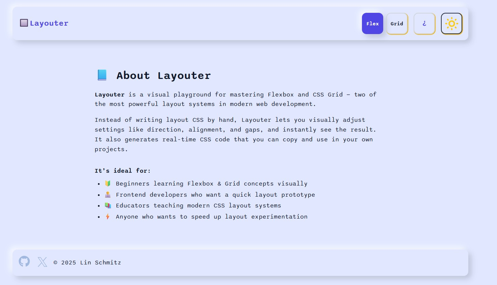
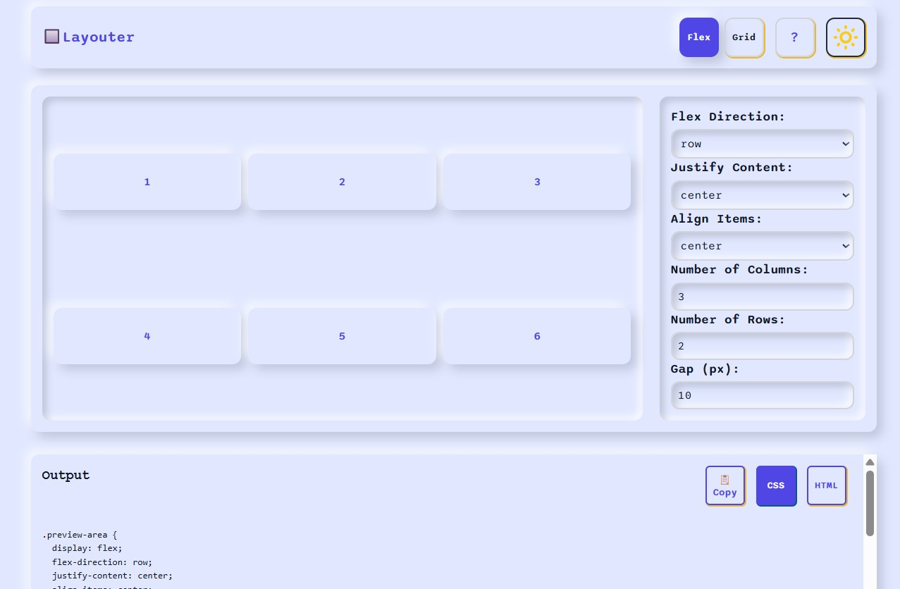
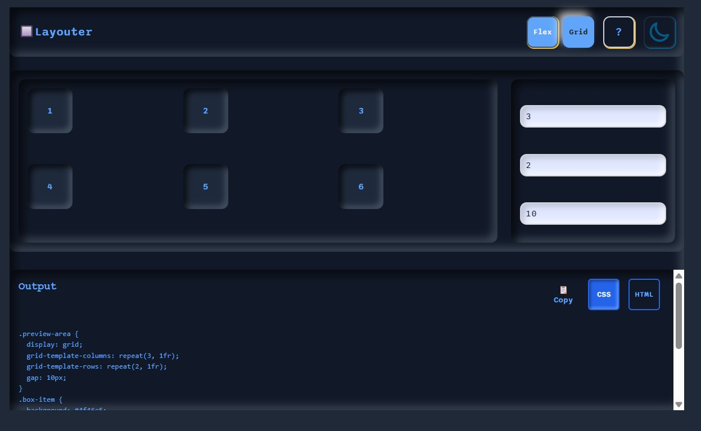

# 🔲 Layouter

Layouter is an interactive visual playground for mastering CSS Flexbox and Grid layouts. It allows you to visually configure layout properties like direction, alignment, gaps, rows, and columns, while instantly seeing the results and generated CSS and HTML code you can copy for your own projects.

- 📷 [Screenshot]
  
  
  

- 🌐 [Live Demo](https://layouter-sch.vercel.app/)

## 🚀 Features

- 🔄 Switch effortlessly between **Flexbox** & **CSS Grid** modes
- 🎛️ Customize Flexbox: direction, justify-content, align-items, columns, rows & gap
- 🧱 Customize Grid: columns, rows & gap
- 👀 Live preview updates with responsive boxes
- 📋 Real-time generated CSS & HTML code with copy-to-clipboard
- 🌙 Dark mode toggle with persistent preference
- ℹ️ Informative About page with app details
- ✨ Clean UI with tooltips & smooth animations

---

## 🧩 Components Overview

- **App**: Manages state & routing 🔄
- **Header**: Navigation + layout & dark mode toggles 🚦
- **LayoutModeToggle**: Flexbox or Grid switcher 🔘
- **DarkModeToggle**: Moon & sun icon toggle 🌞🌜
- **SettingsPanel**: Shows Flex or Grid controls ⚙️
- **FlexSettings**: Flexbox property controls 🔧
- **GridSettings**: Grid property controls 🧱
- **PreviewArea**: Live box layout preview 👁️‍🗨️
- **CssOutput**: Generated CSS & HTML display with copy 📋
- **About**: App description and usage info 📖
- **Footer**: Site footer with icons & copyright 🦶

---

## 🛠️ Installation

```bash
git clone https://github.com/yourusername/layouter.git
cd layouter
npm install
npm start
```

Open your browser at: [http://localhost:3000](http://localhost:3000)

---

## 🎯 Usage

1. Toggle layout mode: **Flex** or **Grid** via header buttons 🔘
2. Adjust settings panel on the right:

   - Flex: direction, justify-content, align-items, columns, rows, gap
   - Grid: columns, rows, gap

3. Watch your layout update live in the preview area 👀
4. Copy generated CSS or HTML code with one click 📋
5. Toggle dark mode 🌙 for late-night coding sessions
6. Click the ❓ icon to read About page info

---

## 💻 Technologies Used

- React 18 ⚛️
- React Router DOM v6 🛣️
- CSS Variables & modern theming 🎨
- Flexbox & CSS Grid fundamentals 🧱

---

## 📁 Folder Structure

```
src/
├── components/
│   ├── About.jsx
│   ├── CssOutput.jsx
│   ├── CssOutput.css
│   ├── DarkModeToggle.jsx
│   ├── DarkModeToggle.css
│   ├── FlexSettings.jsx
│   ├── Footer.jsx
│   ├── GridSettings.jsx
│   ├── Header.jsx
│   ├── LayoutModeToggle.jsx
│   ├── PreviewArea.jsx
│   └── SettingsPanel.jsx
├── App.jsx
├── index.js
└── styles.css
```

---

## 🤝 Contribution

Feel free to fork, open issues, or submit PRs! Let's make Layouter even better together. 🚀✨

---

## 📬 Contact

Created with ☕,🐈 & ❤️ by Lin Schmitz. Reach out anytime!

---

Let me know if you want me to help with anything else!

---
